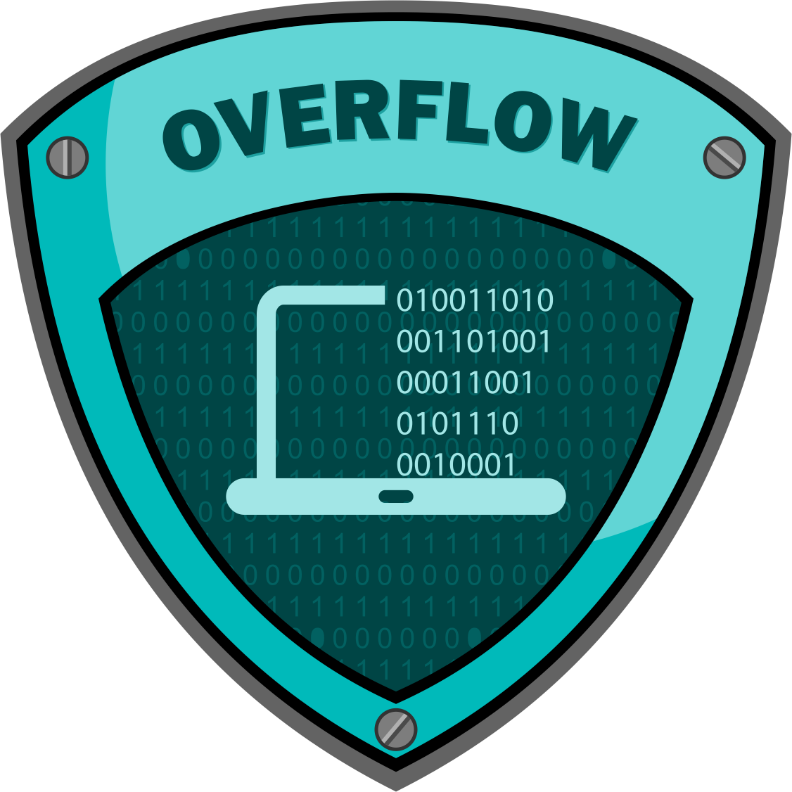

  

<h1 align="center">
  Buffer-Overflow-Attack
</h1>

## Buffer-Overflow-Attack &middot;      ##

This repository contains the code of a simple program in the `C` programming language, in which it is possible to perform a [buffer overflow attack](https://en.wikipedia.org/wiki/Buffer_overflow). The `simple_programm` program in the `Makefile` is defined to build with the disable [canary](https://en.wikipedia.org/wiki/Stack_buffer_overflow#Stack_canaries) flag which is designed to protect against this type of attack (to enable the demonstration). The repository also contains code in the `Python` programming language, through which this type of attack is carried out.

## :computer: Getting Started  ##

**Step 1**

1. Go to home directory and clone repository from github: `cd ~ && git clone https://SergeyIvanovDevelop@github.com/SergeyIvanovDevelop/Buffer-Overflow-Attack`

**Step 2** 

2. Go to the directory of the downloaded repository: `cd ~/Buffer-Overflow-Attack`

**Step 3** 

3. Installing dependencies: 

`pip3 install -r ./requirements.txt` 

**Step 4** 

4. Build the `C` program: `make -f Makefile`

**Step 5** 

5. Execute the `Python` script: `python3 exploit.py`

If a command line prompt appears in the terminal where the `Python` script was executed, this means that all actions have been performed correctly and the attack has been successfully carried out (the `win(void)` function was called from the `simple_program` program, although this function is not called anywhere in this program). An attacker through a vulnerability in a `C` program was able to gain access to the system.

### :bookmark_tabs: Licence ###
Buffer-Overflow-Attack is [CC BY-NC-SA 3.0 licensed](./LICENSE).
